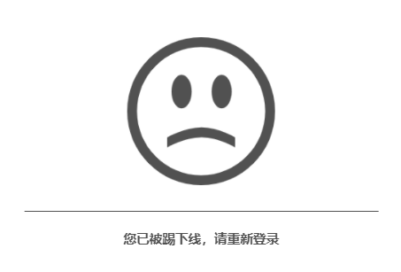

# 踢人下线
所谓踢人下线，核心操作就是找到其指定`loginId`对应的`token`，并设置其失效



--- 


### 根据账号id踢人
让指定账号id的会话注销登录，例如：

``` java
// 使账号id为10001的会话注销登录（踢人下线），待到10001再次访问系统时会抛出`NotLoginException`异常，场景值为-5
StpUtil.logoutByLoginId(10001); 
```

### 根据Token令牌踢人
你还可以让指定token的会话注销登录
``` java
// 使账号id为10001的会话注销登录
StpUtil.logoutByTokenValue("xxxx-xxxx-xxxx-xxxx-xxxx");
```
此方法直接删除了`token->uid`的映射关系，对方再次访问时提示:`token无效`，场景值为-2


### 账号封禁
对于违规账号，有时候我们仅仅将其踢下线还是远远不够的，我们还需要对其进行**账号封禁**防止其再次登录

``` java
// 封禁指定账号 
// 参数一：账号id
// 参数二：封禁时长，单位：秒  (86400秒=1天，此值为-1时，代表永久封禁)
StpUtil.disable(10001, 86400); 

// 获取指定账号是否已被封禁 (true=已被封禁, false=未被封禁) 
StpUtil.isDisable(10001); 

// 获取指定账号剩余封禁时间，单位：秒
StpUtil.getDisableTime(10001); 

// 解除封禁
StpUtil.untieDisable(10001); 
```


#### 注意点
对于正在登录的账号，对其账号封禁时并不会使其立刻注销<br>
如果需要将其封禁后立即掉线，可采取先踢再封禁的策略，例如：
``` java
// 先踢下线
StpUtil.logoutByLoginId(10001); 
// 再封禁账号
StpUtil.disableLoginId(10001, 86400); 
```


> 如果想管理当前账号的session怎么办? 请参考：[Session会话](/use/session)
> 如果想查询所有账号的session怎么办? 请参考：[会话治理](/use/search-session)