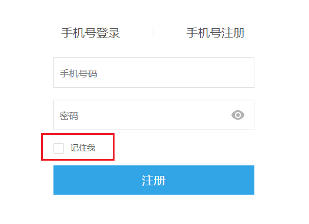

# [记住我]模式
--- 

如下图所示，一般网站的登录界面都会有一个 [ 记住我 ] 按钮，当你勾选它后，即时你关闭浏览器再次打开网站，也依然会处于登录状态，无须重复验证密码



那么在Sa-Token中，如何做到 [ 记住我 ] 功能呢？


### 在sa-token中实现记住我功能

Sa-Token的登录授权，**默认就是`[记住我]`模式**，为了实现`[非记住我]`模式, 你需要在登录时如下设置：

``` java
// 设置登录账号id为10001，第二个参数指定是否为[记住我]，当此值为false后，关闭浏览器后再次打开需要重新登录
StpUtil.login(10001, false);
```

那么，Sa-Token实现`[记住我]`的具体原理是？


### 实现原理
Cookie作为浏览器提供的默认会话跟踪机制，其生命周期有两种形式，分别是：
- 临时Cookie：有效期为本次会话，只要关闭浏览器窗口，Cookie就会消失
- 永久Cookie：有效期为一个具体的时间，在时间未到期之前，即使用户关闭了浏览器Cookie也不会消失

利用Cookie的此特性，我们便可以轻松实现 [记住我] 模式：
- 勾选[记住我]按钮时：调用`StpUtil.login(10001, true)`，在浏览器写入一个`永久Cookie`储存token，此时用户即使重启浏览器token依然有效
- 不勾选[记住我]按钮时：调用`StpUtil.login(10001, false)`，在浏览器写入一个`临时Cookie`储存token，此时用户在重启浏览器后token便会消失，导致会话失效


### 前后台分离模式下如何实现[记住我]?

此时机智的你😏很快发现一个问题，Cookie虽好，却无法在前后端分离环境下使用，那是不是代表上述方案在APP、小程序等环境中无效？

准确的讲，答案是肯定的，任何基于Cookie的认证方案在前后台分离环境下都会失效（原因在于这些客户端默认没有实现Cookie功能），不过好在，这些客户端一般都提供了替代方案，
唯一遗憾的是，此场景中token的生命周期需要我们在前端手动控制

以经典跨端框架 [uni-app](https://uniapp.dcloud.io/) 为例，我们可以使用如下方式达到同样的效果：
``` js
// 使用本地存储保存token，达到 [永久Cookie] 的效果
uni.setStorageSync("satoken", "xxxx-xxxx-xxxx-xxxx-xxx");

// 使用globalData保存token，达到 [临时Cookie] 的效果
getApp().globalData.satoken = "xxxx-xxxx-xxxx-xxxx-xxx";
```

如果你决定在PC浏览器环境下进行前后台分离模式开发，那么更加简单：
``` js
// 使用 localStorage 保存token，达到 [永久Cookie] 的效果
localStorage.setItem("satoken", "xxxx-xxxx-xxxx-xxxx-xxx");

// 使用 sessionStorage 保存token，达到 [临时Cookie] 的效果
sessionStorage.setItem("satoken", "xxxx-xxxx-xxxx-xxxx-xxx");
```

Remember me, it's too easy!


### 登录时指定token有效期
登录时不仅可以指定是否为`[记住我]`模式，还可以指定一个特定的时间作为token有效时长，如下示例：
``` java
// 示例1：
// 指定token有效期(单位: 秒)，如下所示token七天有效
StpUtil.login(10001, new SaLoginModel().setTimeout(60 * 60 * 24 * 7));

// ----------------------- 示例2：所有参数
// `SaLoginModel`为登录参数Model，其有诸多参数决定登录时的各种逻辑，例如：
StpUtil.login(10001, new SaLoginModel()
			.setDevice("PC")				// 此次登录的客户端设备标识, 用于[同端互斥登录]时指定此次登录的设备名称
			.setIsLastingCookie(true)		// 是否为持久Cookie（临时Cookie在浏览器关闭时会自动删除，持久Cookie在重新打开后依然存在）
			.setTimeout(60 * 60 * 24 * 7)	// 指定此次登录token的有效期, 单位:秒 （如未指定，自动取全局配置的timeout值）
			);
```


